# Architecture

PDFCrunch uses a pipeline architecture with multiprocessing for parallel PDF processing and a producer-consumer pattern for thread-safe YOLO person detection.

## Process Flow

```mermaid
flowchart TD
    Start([Run main.py]) --> SelectFiles[select_files: GUI file picker]
    SelectFiles --> BuildList[build_pdf_list: Process selection]
    BuildList --> CheckArchive{Archive file?}
    CheckArchive -->|Yes| ExtractArchive[extract_archive: Extract zip/7z]
    CheckArchive -->|No| AddPDF[Add PDF to list]
    ExtractArchive --> GetPDFs[get_pdf_files_from_directory]
    GetPDFs --> ProcessPDFs
    AddPDF --> ProcessPDFs[process_pdfs: Multiprocessing orchestrator]

    ProcessPDFs --> InitModels[Initialize YOLO model in main process]
    InitModels --> StartConsumer[Start YOLO consumer thread]
    StartConsumer --> SpawnWorkers[Spawn worker processes]
    SpawnWorkers --> InitWorker[_initialize_worker: Init PaddleOCR per worker]

    InitWorker --> WorkerLoop[_process_pdf_worker: Process each PDF]
    WorkerLoop --> PDFContent[process_pdf_content: Main PDF processing]

    PDFContent --> ExtractText[Extract readable text from PDF]
    ExtractText --> CheckText{>50 words?}
    CheckText -->|Yes| SkipOCR[Create preview, skip OCR]
    CheckText -->|No| NeedOCR[Need OCR on images]

    SkipOCR --> ExtractImages1[Extract all images]
    NeedOCR --> ExtractImages2[Extract all images]

    ExtractImages1 --> ProcessImage1[process_single_image: skip_ocr=True]
    ExtractImages2 --> ProcessImage2[process_single_image: skip_ocr=False]

    ProcessImage2 --> IsText{is_text_scan: Check image type}
    IsText -->|Text| RunOCR[ocr_image_region: Extract text]
    IsText -->|Not text| QueueYOLO1[_yolo_scan_queued]
    RunOCR --> CheckWords{>10 words?}
    CheckWords -->|No| QueueYOLO2[_yolo_scan_queued]
    CheckWords -->|Yes| SavePreview[Save OCR preview]

    ProcessImage1 --> QueueYOLO3[_yolo_scan_queued]

    QueueYOLO1 --> YOLOQueue[Add to queue]
    QueueYOLO2 --> YOLOQueue
    QueueYOLO3 --> YOLOQueue

    YOLOQueue --> ConsumerThread[_yolo_consumer_thread: Process queue]
    ConsumerThread --> YOLOScan[yolo_scan: Detect persons]
    YOLOScan --> CheckPerson{Person found?}
    CheckPerson -->|Yes| SavePerson[Save to detected_persons/]
    CheckPerson -->|No| Continue

    SavePerson --> Continue[Continue processing]
    SavePreview --> Continue

    Continue --> SaveImage[save_image_to_disk]
    SaveImage --> MovePDF[Move PDF to folder]
    MovePDF --> PrintProgress[Print progress in main process]
    PrintProgress --> NextPDF{More PDFs?}
    NextPDF -->|Yes| WorkerLoop
    NextPDF -->|No| Complete[Print completion stats]
    Complete --> End([Done])
```



## Core Components

### 1. Main Process Orchestration

**`main()` → `process_pdfs()`**

- Initializes YOLO model once in main process
- Creates shared `Manager.Queue()` for YOLO tasks
- Spawns worker processes (one per CPU core, max = PDF count)
- Starts YOLO consumer thread
- Collects results and prints progress

### 2. Worker Processes

**`_initialize_worker()` → `_process_pdf_worker()`**

- Each worker initializes its own PaddleOCR instance (process-local)
- Shares YOLO queue and results dict via `Manager`
- Processes PDFs independently
- Returns status to main process for printing

**Why separate processes?**
- PaddleOCR is CPU-intensive (multiprocessing scales)
- Each process gets own memory space (no GIL contention)
- Windows uses "spawn" (completely separate processes)

### 3. YOLO Consumer Thread

**`_yolo_consumer_thread()` with `yolo_scan()`**

- Single thread in main process
- Consumes tasks from shared queue
- Runs YOLO inference sequentially (thread-safe)
- Stores results in shared dict with task UUID

**Why producer-consumer pattern?**
- YOLO model is NOT thread-safe (fuse() race condition)
- Workers queue tasks, main thread processes them
- Prevents `AttributeError: 'Conv' object has no attribute 'bn'`

### 4. Intelligent Text Extraction

**Decision Tree:**
```
PDF opened
  ↓
Extract all text → Count words
  ↓
> 50 words?
  ├─ YES: Skip OCR, only run YOLO on images
  └─ NO: Run OCR on text-like images
         ↓
         is_text_scan() → Edge density analysis
           ├─ Text (8-30% edges): Run OCR
           │    ↓
           │    < 10 words? → Also run YOLO
           └─ Not text: Skip OCR, run YOLO
```

### 5. Image Classification

**`is_text_scan()` - Edge Density Analysis**

```python
edges = cv2.Canny(grayscale, 50, 150)
edge_density = edges.sum() / total_pixels

# Classification thresholds
if edge_density < 0.08 or edge_density > 0.30:
    return False  # Too few/many edges for text
elif edge_density > 0.10:
    return True   # Text document
```

**Removed for performance:**
- Connected components analysis (3x slower)
- Color variance calculations
- Aspect ratio checks

### 6. Person Detection

**`yolo_scan()` - YOLOv8 Pose**

```python
results = model(img_array, conf=0.5)
for detection in person_detections:
    keypoints = detection.keypoints  # 17 keypoints per person
    visible = (keypoints[:, 2] > 0.3).sum()  # Confidence > 0.3
    if visible > 0:  # At least 1 keypoint
        person_detected = True
```

**Low keypoint threshold:**
- Detects heavily censored/partial persons
- Useful for redacted documents
- Confidence threshold 0.5 for bounding boxes
- Confidence threshold 0.3 for keypoints

## Performance Optimizations

1. **Multiprocessing**: ~8x speedup (8 cores)
2. **OCR Skipping**: ~90% faster for text PDFs
3. **Edge density only**: 3x faster than connected components
4. **Queue-based YOLO**: Avoids thread-safety crashes
5. **Shared resources**: YOLO queue, results dict, page counter

## Output Organization

```
working_directory/
├── detected_persons/           # Shared across all PDFs
│   ├── pdf1_page_2_img_1.png
│   └── pdf2_page_5_img_3.png
│
├── pdf1/
│   ├── pdf1.pdf
│   ├── pdf1_preview.txt
│   ├── page_1_img_1.jpg
│   └── page_2_img_1.png
│
└── pdf2/
    ├── pdf2.pdf
    ├── pdf2_preview.txt
    └── page_1_img_1.png
```

## Technology Stack

| Component | Technology | Purpose |
|-----------|-----------|---------|
| PDF Processing | PyMuPDF (fitz) | Text extraction, image extraction |
| OCR | PaddleOCR 3.x | Text recognition from images |
| Person Detection | YOLOv8-Pose (Ultralytics) | Detect persons with keypoints |
| Image Analysis | OpenCV + NumPy | Edge detection, image classification |
| Parallelization | ProcessPoolExecutor | Multiprocessing for PDFs |
| Thread Coordination | threading.Thread + Manager.Queue | YOLO consumer thread |
| Archive Handling | zipfile + py7zr | Extract archives |
